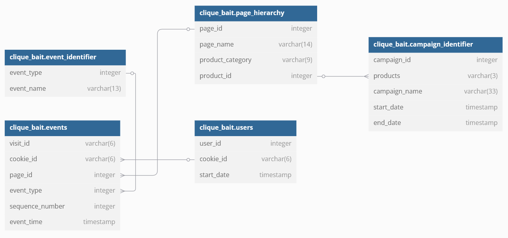
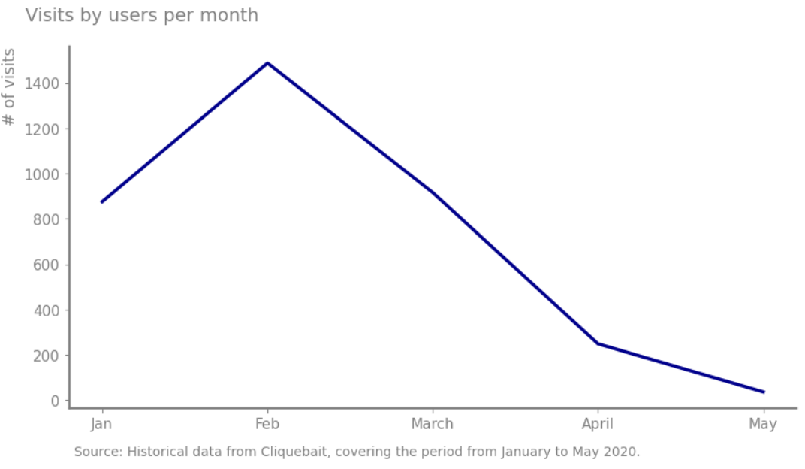
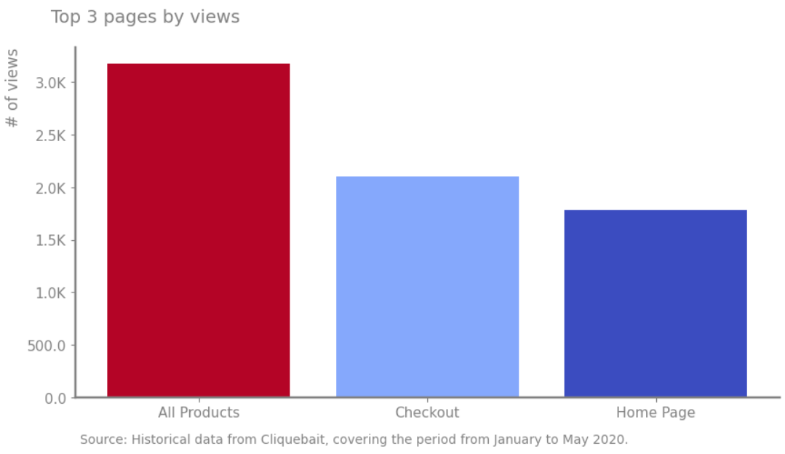
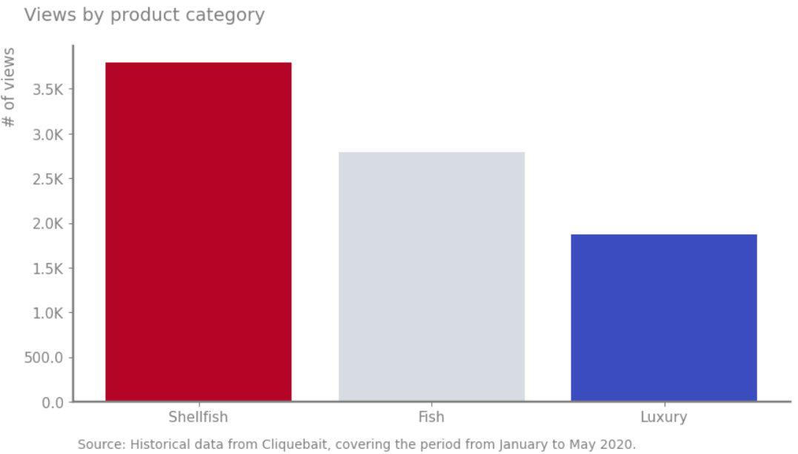
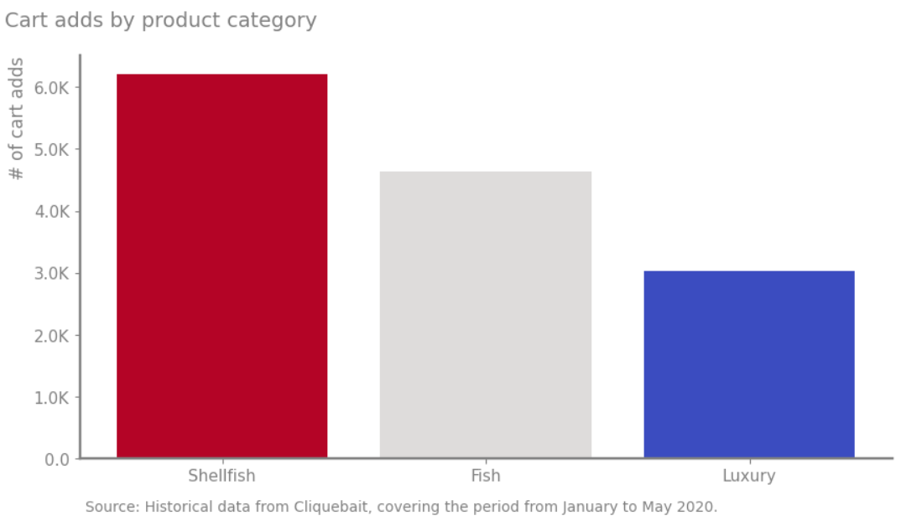
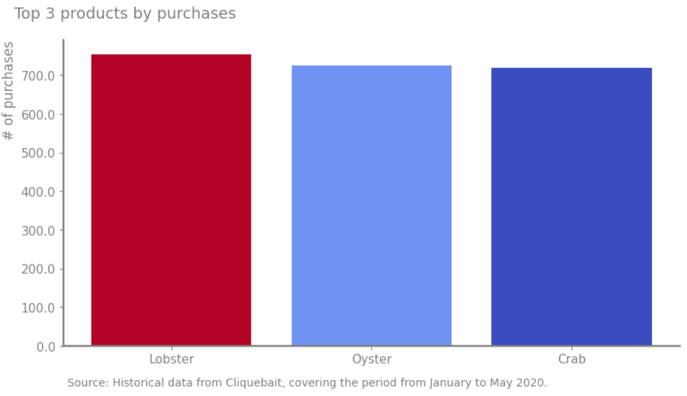

# CliqueBait case study

## Project background

Clique Bait is not like your regular online seafood store - the founder and CEO Danny, was also a part of a digital 
data analytics team and wanted to expand his knowledge into the seafood industry!

The company has significant amounts of information about its users, their digital platform, and how they react after different marketing campaigns.

Insights are provided in the following areas:

- Digital analysis: Measure how users interact with the platform after different marketing campaigns. Track general 
metrics, such as the number of users, events for each event type, and the percentage of visits with a purchase event.

- Product funnel analysis: Assess the effectiveness of marketing campaigns for each product. Track metrics, such as 
the most viewed product, cart adds, and purchases.

- Campaign analysis: Evaluate each marketing campaign’s performance. Track metrics, such as CTR, conversion rate, 
cart add rate, and purchase per impression.

An interactive Kaggle notebook containing all analysis can be found [here](https://www.kaggle.com/code/christianmontenegro/clique-bait-case-study).

## Data structure & initial checks

The Cliquebait database structure, as seen below, consists of five tables: users, events, event identifier, page hierarchy, and campaign identifier, with a total row count of 34,535 records.

Before starting the analysis, I conducted several checks to ensure the quality and understanding of the tables. The Python scripts 
used for these tasks are in the same Kaggle notebook.

## Executive summary

### Overview of findings

All campaigns are effective, with click-through rates (CTRs) and conversion rates higher than average. Half Off - Treat Your Shellf (ish) has the best buy efficiency, achieving 2.04 
purchases per impression. It’s the top performer per return on investment (ROI). 25% Off - Living The Lux Life leads in cart engagement with 
2.46 adds/visits, and has better conversion rates, making it great for upselling. BOGOF has the highest first engagement at 
84.6% CTR, but is inefficient, showing users may need incentives to complete their purchases. The following sections will explore 
contributing factors to the results and highlight key areas for improvement.

### Digital analysis

- The platform has registered 500 users.

- The average number of cookies per user was 3.56.

- Most users visited the platform in January (876), with the highest number in February (1,488). After that, the visits decreased month to month. May had the fewest visits, at only 36.

- Most users visit the platform to view the products, with 20,927 views. Following that, 8451 users add products to their carts. 1,776 users proceed to purchase the products. Additionally, 875 users reacted to the ads, while 702 users clicked on the ads.

- Almost half of the visits, 49.83%, result in a purchase.

- Fewer than 20% (15.51%) of the visits that view the checkout page result in a purchase.

- The three most visited pages were all product-related with 3,174 visits. The checkout page, which recorded 2,102 visits, 
followed this, and the home page, with 1,782 visits.

- The three most viewed product categories were Shellfish with 3,791 views. Fish, which recorded 2,789 views, and Luxury 
which received 1,871 views followed this.

- The product categories with the highest number of cart additions were: Shellfish with 6,204 additions, topped 
the list. Fish, which recorded 4,632 additions, and Luxury, which received 3,033 additions followed this.

- The three products with the highest sales volumes were Lobster, with 753 units sold. Oyster, which achieved sales of 724 units, and Crab, with 718 units sold, followed this.

### Product funnel analysis

- **High product visibility**: All products exhibit a relatively high number of views, ranging from 1,470 to 1,567. This pattern indicates strong product visibility and potentially high site traffic.

- **Consistent conversion rates (cart adds to purchases):** The number of items added to the cart compared to those purchased is similar
 for most products. For every 920 to 968 cart adds, around 697 to 753 turn into purchases. This shows that the conversion rate is roughly the same across products.

- **Abandonment Rate:** The number of abandoned carts is also steady, making up a large part of cart adds. Customers abandon 
214 to 249 items out of every 920 to 968 items added. This points to an opportunity to improve by reducing cart abandonment.

| page_name      |   views |   cart_adds |   abandoned |   purchased |
|:---------------|--------:|------------:|------------:|------------:|
| Abalone        |    1525 |         932 |         233 |         699 |
| Black Truffle  |    1470 |         925 |         219 |         706 |
| Crab           |    1565 |         950 |         232 |         718 |
| Kingfish       |    1559 |         920 |         214 |         706 |
| Lobster        |    1547 |         968 |         215 |         753 |
| Oyster         |    1567 |         941 |         217 |         724 |
| Russian Caviar |    1563 |         946 |         249 |         697 |
| Salmon         |    1559 |         938 |         227 |         711 |
| Tuna           |    1514 |         931 |         234 |         697 |

- Conversion rates are almost equal across all categories (around 45-47%). This means 
that for every view, roughly half are purchased, regardless of category.

- Add-to-cart rates are remarkably similar across all categories (around 60.2-61.7%). This means that for every view, 
roughly the same proportion of users are adding products to their cart, regardless of the category.

- Purchase rates from cart adds are also very similar across all categories (around 75-76%). This indicates 
that once products are in the cart, the likelihood of purchase is consistent across categories.

- Abandonment rates are also consistently around 23-25% across categories. This reinforces the idea that cart 
abandonment issues are likely systemic rather than category-specific.

| product_category   |   views |   cart_adds |   abandoned |   purchased |
|:-------------------|--------:|------------:|------------:|------------:|
| Fish               |    4632 |        2789 |         675 |        2114 |
| Luxury             |    3033 |        1871 |         468 |        1403 |
| Shellfish          |    6204 |        3791 |         897 |        2894 |

The results can be summarized as:

| Metric             | Best Performer | Weakest Performer |
|--------------------|----------------|-------------------|
| Conversion Rate    | Shellfish      | Fish              |
| Cart Abandonment   | Shellfish      | Luxury            |
| Cart Add Rate      | Luxury         | Fish              |
| Purchase Rate      | Shellfish      | Luxury            |

- The product that got the most views was Oyster with 1,567 views

- The product that got most additions to cart and purchases was Lobster with 968 adds and 753 purchases.

- The product people most likely abandoned was Russian Caviar, which had a 26.3% abandonment rate.

- The product with the highest rate of views turning into purchases was Lobster, with a 48.7% rate.

- The average rate of views turning into cart additions was 60.9%.

- The average rate of cart additions turning into purchases was 75.9%.

### Campaign analysis

- The marketing campaigns proved effective. Data shows that the adjustments in the exposed 
group—users who received impressions during any campaign—resulted in improved outcomes across several key areas.

- The exposed group shows significantly higher engagement, including increased page views (2x), a greater number 
of items added to the cart (3x), and a higher purchase rate (2x). Across all campaigns, users with impressions 
viewed nearly twice as many pages (8.5-8.8) compared to those without (4.9-5.1). Users with impressions added 
5+ items to their carts on average, while those without added only ~1.5 items. And users with impressions 
converted at 82-85%, compared to 37-38% for users without impressions.

| campaign                          | group              |   user_count |   avg_page_views |   avg_cart_adds |   purchase_rate |
|:----------------------------------|:-------------------|-------------:|-----------------:|----------------:|----------------:|
| Half Off - Treat Your Shellf(ish) | With Impression    |          352 |          8.51038 |         5.00346 |        0.852941 |
| Half Off - Treat Your Shellf(ish) | Without Impression |          449 |          4.95967 |         1.49116 |        0.379558 |
| 25% Off - Living The Lux Life     | With Impression    |           91 |          8.64423 |         5.10577 |        0.826923 |
| 25% Off - Living The Lux Life     | Without Impression |          160 |          5.11667 |         1.53667 |        0.383333 |
| BOGOF - Fishing For Compliments   | With Impression    |           59 |          8.76923 |         5.35385 |        0.846154 |
| BOGOF - Fishing For Compliments   | Without Impression |          103 |          4.95385 |         1.42051 |        0.369231 |

All campaigns experienced an uplift in purchase rate except BOGOF compared with impression-only users. In the 25% Off - Living the Lux Life campaign, 
clicks drive a 44.6% uplift over non-impressed users and a 12.7% uplift over impression-only users. In the BOGOF campaign, 
clickers convert at 98%, but impression-only users convert at 100% (negative uplift of -2%). The Half Off - Treat Your Shellf(ish) 
campaign has clickers who convert at 99.3%, with a 30.2% uplift over non-impressed users. Meanwhile, 3.97% uplift over impression-only 
users, suggesting impressions alone are highly effective. 

| Campaign                          |   clicked |   impression |   no impression |   uplift_C_vs_N |   uplift_C_vs_I |
|:----------------------------------|----------:|-------------:|----------------:|----------------:|----------------:|
| 25% Off - Living The Lux Life     |  0.901408 |     0.8      |        0.623188 |        0.446446 |        0.126761 |
| BOGOF - Fishing For Compliments   |  0.98     |     1        |        0.636364 |        0.54     |       -0.02     |
| Half Off - Treat Your Shellf(ish) |  0.993485 |     0.955556 |        0.762887 |        0.302271 |        0.039694 |

Each campaign excels has its strength. The 25% Off - Living The Lux Life campaign has the best conversion rate, 
meaning it gets the most people to take action and engage. High ad engagement mark the BOGOF campaign, 
with many people clicking on the ads, but it needs to improve in terms of purchases after people click. The 
Half Off - Treat Your Shellf(ish) campaign is the most efficient, performing well without using many resources. The table 
below summarizes the results.

| Campaign                           | CTR      | Conversion Rate | Cart Add Rate | Purchase per Impression |
|------------------------------------|----------|-----------------|---------------|-------------------------|
| BOGOF - Fishing For Compliments     | 0.846154 | 0.488462        | 0.692308     | 0.846154               |
| 25% Off - Living The Lux Life      | 0.778846 | 0.497525        | 0.710396      | 0.826923                |
| Half Off - Treat Your Shellf(ish) | 0.801038 | 0.494137        | 0.701424      | 0.852941                |

## Recommendations

1. For 25% Off - Living The Lux Life:

  1.1 Increase Reach: Raise ad spending to expand impression reach while maintaining efficient conversions.

  1.2 Optimize Post-Click Experience: Ensure that landing pages align with the promises made in ads to retain high-intent users.

2. For BOGOF - Fishing For Compliments:

  2.1 Clarify Offer Terms: Address any potential confusion related to "Buy One Get One Free" offer.

  2.2 A/B Test Landing Pages: Reduce cart abandonment by streamlining the checkout process through A/B testing.

3. For Half Off - Treat Your Shellf(ish):

  3.1 Expand Audience: Increase impression reach by using the effective conversion model.

  3.2 Leverage High click-through rate (CTR): Experiment with urgency tactics, such as countdown timers, to enhance conversions further.

